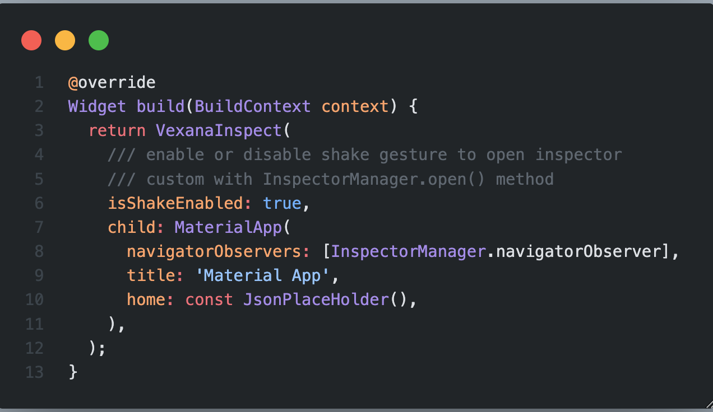

Applications with basic implementation will be able to access dashboards for network requests made by this library.

| Example    | Usage |
| -------- | ------- |
| <!--  -->
  |   | 

  


# How to use

Just wrap your root widget with the VexanaInspect widget and set the isEnableShake property to true. This will allow you to open the dashboard by shaking your phone.

> You should install [Vexana](https://pub.dev/packages/vexana) before you can use this package.

```dart
VexanaInspect(
      isEnableShake: true,
      child: MaterialApp(
      // Have to implement this line
      navigatorObservers: [InspectorManager.navigatorObserver]
      )
  ,);
```


## Inspector open manually 

Once the implementation is complete, you can just call the open function with the inspector instance. Instead of shake option. 
Your project can work with any button or etc with this function.

```dart
InspectorManager.open();
```

## Additional information

You can found a sample in [example](example/lib/main.dart) folder.
Please add your thoughts to an issue or PR review and I will merge it as soon as possible.

## License

MIT License

Copyright (c) [2023] [Veli Bacik]

Permission is hereby granted, free of charge, to any person obtaining a copy
of this software and associated documentation files (the "Software"), to deal
in the Software without restriction, including without limitation the rights
to use, copy, modify, merge, publish, distribute, sublicense, and/or sell
copies of the Software, and to permit persons to whom the Software is
furnished to do so, subject to the following conditions:

The above copyright notice and this permission notice shall be included in all
copies or substantial portions of the Software.

THE SOFTWARE IS PROVIDED "AS IS", WITHOUT WARRANTY OF ANY KIND, EXPRESS OR
IMPLIED, INCLUDING BUT NOT LIMITED TO THE WARRANTIES OF MERCHANTABILITY,
FITNESS FOR A PARTICULAR PURPOSE AND NONINFRINGEMENT. IN NO EVENT SHALL THE
AUTHORS OR COPYRIGHT HOLDERS BE LIABLE FOR ANY CLAIM, DAMAGES OR OTHER
LIABILITY, WHETHER IN AN ACTION OF CONTRACT, TORT OR OTHERWISE, ARISING FROM,
OUT OF OR IN CONNECTION WITH THE SOFTWARE OR THE USE OR OTHER DEALINGS IN THE
SOFTWARE.
